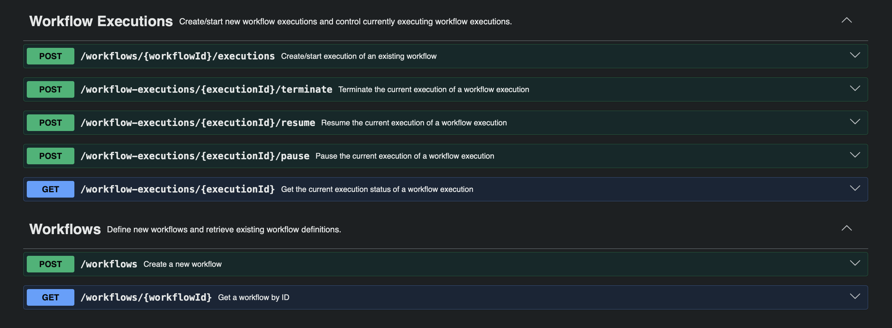

# Workflow Engine & Workout Analytics Platform

A event-driven workflow engine with a fitness analytics pipeline built on top of it. Define workflows as DAGs, execute 
long-running jobs asynchronously, pause/resume/terminate them cooperatively, and generate AI-assisted PDF reports from cohort training data.

### Demo
▶ [Workout Analytics Demo](https://youtu.be/UxV8Rf9_7RQ)

▶ [Workflow Engine Demo](https://youtu.be/huR1IJPJZyA)

---
## Architectural Diagrams

### Workflow Engine Diagram


### Workout Analytics Diagram

---
## Workflow

### Purpose

A distributed workflow engine built with Spring Boot, Kafka, Redis, and PostgreSQL. It's
designed to be a general-purpose pipeline runner, similar to Apache Airflow or Temporal. A workflow is defined
by its steps (a directed acyclic graph) and executes as a
long-running job, with the option to pause, resume, or terminate a currently executing workflow. Multiple executions 
can be started at once, and will execute concurrently.

### Motivation

During my co-op, one of my major tasks was figuring out how to add controls to long-running batch jobs. The
task seemed simple on paper, but there wasn't a universally good solution as every approach had drawbacks. My
solution worked, but wasn't optimal, and I ran out of time to improve it before my work term ended.

The problem kept sticking with me, so I revisited it here, aiming for a better solution and combining it with
something aligned with my personal hobbies.

For now, the only executable sequence is the workout analytics platform (below), but I will be adding more
the future.

### Job Control: Pause / Resume / Terminate

Job control uses cooperative checkpointing rather than thread interruption. While a workflow is running, each step 
periodically reaches a checkpoint at a safe point in its execution, such as between batches during a large 
CSV import. At each checkpoint, the worker checks the execution's control state in Redis `checkpointStep` to determine whether it 
should continue, pause, or terminate.
- `checkpoint(workflowExecutionId)` is called between steps, touches workflow-level state only.
- `checkpointStep(workflowExecutionId, stepId)` is called mid-step (inside batch loops), since a step is actively 
  `RUNNING`.
- **Terminate is treated like a transaction.** `WorkflowControlGate.terminateWorkflow()` marks the workflow `TERMINATED`, sweeps all step statuses (`RUNNING`/`PAUSED` → `TERMINATED`, `READY` → `SKIPPED`), and calls `WorkflowCleanupService` to delete every persisted output row for that execution.
- Step statuses: `READY, RUNNING, FAILED, PAUSED, TERMINATED, COMPLETED, SKIPPED`. A step failure sweeps all not-yet-started steps to `SKIPPED`, distinct from an explicit `TERMINATE`.
- Step methods return `JobControl` rather than `void`/`boolean`. Callers must check and propagate a `TERMINATE` 
  signal *before* calling `complete()`/`fail()`, otherwise you get a cascading `IllegalStateException` chain.

### Defining a Workflow

```json
{
  "workflowName": "my workflow", 
  "cohortProfile": { 
    "age": 23,
    "weightKg": 76,
    "heightCm": 174,
    "sex": "MALE",
    "goal": "FAT_LOSS",
    "participants": 100,
    "durationDays": 100
  },
  "data": { 
    "input": "workout.csv", 
    "output": "report.pdf" 
  },
  "steps": [ 
    {
      "stepId": 1,
      "stepName": "INGEST_CSV",
      "dependsOnStepIds": []
    },
    {
      "stepId": 2,
      "stepName": "AGGREGATE_DATA",
      "dependsOnStepIds": [1]
    },
    {
      "stepId": 3,
      "stepName": "EVALUATE_METRICS",
      "dependsOnStepIds": [2]
    },
    {
      "stepId": 4,
      "stepName": "GENERATE_SUMMARY",
      "dependsOnStepIds": [3]
    }
  ]
}
```

---

## Workout Analytics Platform

### Purpose

Based on your daily tracked fitness data, determine if you're on track to meet your goals. Analyzes your data
and gives you areas for improvement and areas you've done well in. This analysis also works on multiple
people at once (cohorts of up to 10,000), as long as the group shares a similar demographic (same age, goal, starting
weight, gender, height, and days tracked).

### I/O

Input a CSV file matching the format in `data/input`. Output is a PDF file. A sample is provided in `data/output`.

### Intended User

Fitness enthusiasts who want to optimize their training/nutrition journey, and research groups studying a cohort
of similarly-demographic people over a period of time.

### Motivation

This project came out of my interest in weightlifting and hypertrophy/fat-loss programming. Through 5
years of consistent training and studying exercise science, I've worked out the key factors behind
someone's success in reaching their fitness goals, especially after talking with experienced bodybuilders,
regular folks at the gym, and coaching several friends and family members myself.

### Pipeline

```
INGEST_CSV → AGGREGATE_DATA → EVALUATE_METRICS → GENERATE_SUMMARY
```

Each step runs asynchronously, checkpoints its progress, and can be paused, resumed, or terminated mid-step.

#### 1. `INGEST_CSV`
Reads the input CSV in batches of 10,000 rows via `BufferedReader`, validating and persisting each batch,
checkpointing between batches so a pause/resume lands cleanly on a batch boundary. This step also validates
the CSV data against your starting stats (in `CohortProfile`) to catch mistakes early.

#### 2. `AGGREGATE_DATA`
Streams the persisted records, sorted by `(userId, date)`, and aggregates each user's records into a single row.
That row represents their average stats across the entire tracked duration.

#### 3. `EVALUATE_METRICS`
Computes a set of "ideal" target ranges based on age, weight, duration, and gender (specified in the initial
`CohortProfile` in the workflow definition request), and scores every user's aggregates against them
across 11 metric definitions, tracking pass/fail counts and how far failures deviate from their boundary. It also
distinguishes between failing by being too far above vs. too far below the ideal.
Results are persisted as a fully relational entity graph rather than a JSON blob, so the
report stays queryable for the next step.

#### 4. `GENERATE_SUMMARY`
Retrieves the persisted report and ideal ranges, sends both to an LLM (Gemini, via Spring AI) to summarize the
findings, and renders a PDF (using Thymeleaf and openhtmltopdf).

### How Metrics Are Evaluated

Each cohort gets a set of "ideal ranges" derived from established exercise-science principles. These include calorie and
macro targets based on estimated energy expenditure, training volume and intensity targets, sleep and step
benchmarks. Every user's tracked data is compared against these ranges to see where they're on track and where
they're falling short.

### Limitations / Assumptions
- Cohort analysis assumes a reasonably homogeneous group (similar age, goal, starting weight, gender, height,
  tracked duration). Mixing very different demographics will skew the "ideal" targets.
- This is not medical advice. Targets are based on general exercise-science heuristics, not individualized clinical guidance.

---

## Getting Started

### Prerequisites

- [Docker](https://www.docker.com/) with Docker Compose
- Create a [Google Gemini API key](https://aistudio.google.com)

No local installation of Java, PostgreSQL, Kafka, or Redis is required. These
services are provided through Docker Compose.

### Configuration

The application requires a Gemini API key for generating the report narrative.

Set the `GEMINI_API_KEY` environment variable:

```bash
export GEMINI_API_KEY=your_api_key_here
```

### Run application

Navigate to the project directory and run `docker compose up --build`.

---

## Tech Stack

| Layer | Choice                                                                      |
|---|-----------------------------------------------------------------------------|
| Framework | Spring Boot                                                                 |
| Async messaging | Apache Kafka (KRaft mode)                                                   |
| State / control signals | Redis                                                                       |
| Persistence | PostgreSQL                                                                  |
| PDF rendering | openhtmltopdf + Thymeleaf (standalone `TemplateEngine`, no MVC auto-config) |
| AI summary generation | Gemini via Spring AI `ChatModel`                                            |
| Testing | JUnit 5, Mockito                                                            |

---

## API


Full API spec available at `http://localhost:8080/swagger-ui/index.html`.

---

## Status

Fully functional MVP. The pipeline runs end-to-end. 100% test coverage.